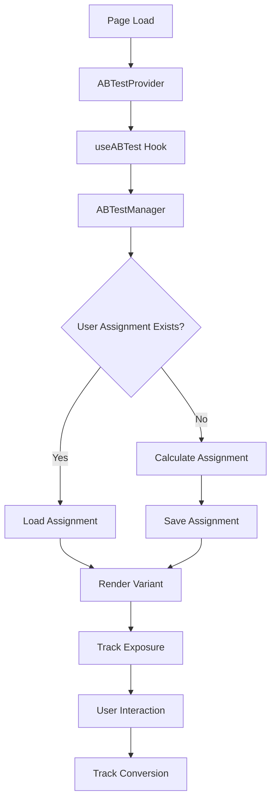

# Système A/B Testing OmniRealm

## Vue d'ensemble

Le système d'A/B testing d'OmniRealm permet d'optimiser les conversions sur les landing pages en testant différentes variantes de contenu, design et prix. Il est intégré avec Plausible Analytics pour un tracking privacy-first.

## Architecture

### Composants principaux

- **`useABTest`** : Hook React pour gérer les tests A/B individuels
- **`ABTestProvider`** : Contexte React pour gérer plusieurs tests
- **`ABTestManager`** : Classe singleton pour la logique de base
- **`activeTests`** : Configuration des tests actifs

### Flux de données



## Configuration des tests

### Structure d'un test A/B

```typescript
interface ABTest {
  id: string;              // Identifiant unique
  name: string;            // Nom descriptif
  enabled: boolean;        // Actif/Inactif
  startDate?: Date;        // Date de début (optionnel)
  endDate?: Date;          // Date de fin (optionnel)
  variants: ABVariant[];   // Liste des variants
}

interface ABVariant {
  id: string;              // Identifiant du variant
  name: string;            // Nom descriptif
  weight: number;          // Poids pour la distribution (0-100)
  config?: Record<string, any>; // Configuration spécifique
}
```

### Exemple de configuration

```typescript
export const omniScanHeroTest: ABTest = {
  id: 'omniscan_hero_messaging',
  name: 'OmniScan Hero Messaging Test',
  enabled: true,
  variants: [
    {
      id: 'control',
      name: 'OCR Intelligent (Control)',
      weight: 50,
      config: {
        headline: 'OCR Intelligent avec IA',
        ctaPrimary: 'Essayer Gratuitement'
      }
    },
    {
      id: 'variant_a',
      name: 'Extraction Automatique',
      weight: 50,
      config: {
        headline: 'Extraction Automatique de Données',
        ctaPrimary: 'Démarrer l\'Extraction'
      }
    }
  ]
};
```

## Utilisation

### 1. Setup basique

```tsx
import { ABTestProvider } from '@/components/ab-testing/ABTestProvider';

function MyPage() {
  return (
    <ABTestProvider product="omniscan">
      {/* Contenu de la page */}
    </ABTestProvider>
  );
}
```

### 2. Hook individuel

```tsx
import { useABTest } from '@/hooks/useABTest';
import { omniScanHeroTest } from '@/lib/abTests';

function HeroSection() {
  const { variant, config, isVariant, trackConversion } = useABTest(omniScanHeroTest);
  
  const handleCTAClick = () => {
    trackConversion('cta_click');
  };
  
  return (
    <div>
      <h1>{config.headline}</h1>
      <button onClick={handleCTAClick}>
        {config.ctaPrimary}
      </button>
    </div>
  );
}
```

### 3. Contexte global

```tsx
import { useABTestContext } from '@/components/ab-testing/ABTestProvider';

function SomeComponent() {
  const { isVariant, trackConversion } = useABTestContext();
  
  if (isVariant('omniscan_hero_messaging', 'variant_a')) {
    // Logique spécifique au variant A
  }
}
```

## Tests actuellement configurés

### OmniScan

1. **Hero Messaging** (`omniscan_hero_messaging`)
   - Control: "OCR Intelligent avec IA"
   - Variant A: "Extraction Automatique de Données"

2. **CTA Style** (`omniscan_cta_style`)
   - Control: Bouton bleu
   - Variant A: Bouton vert
   - Variant B: Bouton orange avec urgence

3. **Pricing Display** (`omniscan_pricing_display`)
   - Control: Prix standard
   - Variant A: Prix avec remise et urgence

4. **Social Proof** (`omniscan_social_proof`)
   - Control: Pas de preuve sociale
   - Variant A: Statistiques d'usage
   - Variant B: Témoignages clients

## Métriques de conversion

### Objectifs principaux
- `SIGNUP` : Inscription utilisateur
- `TRIAL_START` : Début d'essai gratuit  
- `SUBSCRIPTION` : Souscription payante

### Micro-conversions
- `CTA_CLICK` : Clic sur call-to-action
- `PRICING_VIEW` : Vue de la section prix
- `FEATURE_VIEW` : Vue des fonctionnalités

### Engagement
- `SCROLL_50` : Scroll à 50%
- `SCROLL_90` : Scroll à 90%
- `TIME_ON_PAGE_60S` : Temps sur page > 60s
- `TIME_ON_PAGE_180S` : Temps sur page > 3min

## Tracking et Analytics

### Événements Plausible

Le système track automatiquement :

```javascript
// Exposition au test
plausible('AB Test: Exposure', {
  props: {
    test_id: 'omniscan_hero_messaging',
    variant: 'variant_a',
    user_id: 'user_123'
  }
});

// Conversion
plausible('AB Test: Conversion', {
  props: {
    test_id: 'omniscan_hero_messaging',  
    variant: 'variant_a',
    conversion_type: 'cta_click',
    user_id: 'user_123'
  }
});
```

### Conformité RGPD

- Utilise le système de consentement cookies existant
- Pas de tracking sans consentement analytics
- Données pseudonymisées avec user_id généré

## Dashboard

Accès : `/admin/ab-tests`

Fonctionnalités :
- Vue d'ensemble de tous les tests actifs
- Métriques par variant (expositions, conversions, taux)
- Calcul de significativité statistique
- Sélection d'objectifs de conversion
- Réinitialisation des données de test

## Stockage des données

### LocalStorage
- `ab-test-assignments` : Assignations utilisateur
- `ab-user-id` : Identifiant utilisateur persistant
- `cookie-consent` : État du consentement

### Format des assignations

```json
{
  "omniscan_hero_messaging": {
    "variant": "variant_a",
    "testId": "omniscan_hero_messaging", 
    "assignedAt": 1642694400000,
    "exposed": true
  }
}
```

## Algorithme d'assignation

1. **Génération User ID** : ID persistant en localStorage
2. **Hash déterministe** : `hash(testId + userId) % 10000`
3. **Distribution pondérée** : Selon les poids des variants
4. **Consistency** : Même utilisateur = même variant

## Performance

### Optimisations
- Assignations en mémoire (Map)
- LocalStorage asynchrone uniquement pour les changements
- Lazy loading des composants A/B
- Pas de re-renders inutiles

### Métriques
- < 1ms assignation variant
- < 5ms rendu initial
- < 100KB poids bundle ajouté

## Tests unitaires

```bash
npm test -- hooks/useABTest.test.ts
```

Tests couverts :
- Assignation de variants
- Persistance des assignations  
- Respect des poids
- Gestion des dates
- Tracking des conversions

## Déploiement

### Activation d'un test

1. Configurer le test dans `/lib/abTests.ts`
2. Ajouter aux `activeTests`
3. Créer les composants optimisés si nécessaire
4. Tester en local avec le dashboard
5. Déployer

### Désactivation d'un test

1. Mettre `enabled: false`
2. Ou retirer de `activeTests`
3. Les utilisateurs existants gardent leur assignation

## Bonnes pratiques

### Configuration des tests
- Toujours tester avec un groupe de contrôle
- Durée minimum : 2 semaines
- Taille d'échantillon minimum : 1000 vues par variant
- Un seul élément modifié par test

### Analyse des résultats  
- Attendre significativité statistique (p < 0.05)
- Surveiller les métriques business (revenus, LTV)
- Analyser par segments d'utilisateurs
- Documenter les apprentissages

### Développement
- Tests unitaires obligatoires
- Fallback sur le variant de contrôle
- Performance monitoring
- Mobile-first design

## Roadmap

- [ ] Tests multivariés (A/B/C/D)
- [ ] Segmentation utilisateurs  
- [ ] API d'administration
- [ ] Intégration Stripe pour revenue tracking
- [ ] Tests sur mobile app
- [ ] Machine learning pour auto-optimisation

## Support

Pour questions ou problèmes :
- Documentation : Ce fichier
- Dashboard : `/admin/ab-tests` 
- Tests : `npm test`
- Issues : GitHub repository

---

*Dernière mise à jour : 13 août 2025*